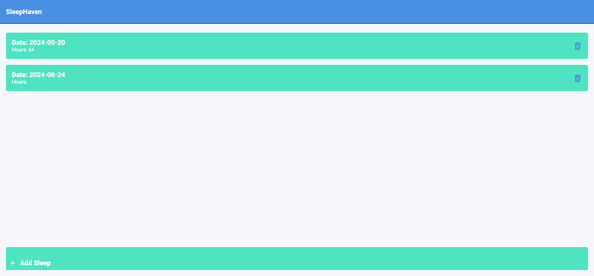

# SleepHaven
A cross-platform Sleep Tracker app built with React Native and Expo. SleepHaven allows users to log and manage their sleep data with an intuitive interface. The app supports both Android and iOS, with features such as:

<b>Date Picker</b>: Easily select the date for each sleep entry.

<b>Local Storage</b>: Sleep data is stored locally on the device using AsyncStorage.

<b>Display & Delete</b>: View your sleep history in a scrollable list and delete entries as needed.

<b>Cross-Platform</b>: Optimized for both mobile and web platforms, with tailored UI adjustments.

This project serves as a comprehensive example of building a React Native application with core functionalities and platform-specific adjustments.

